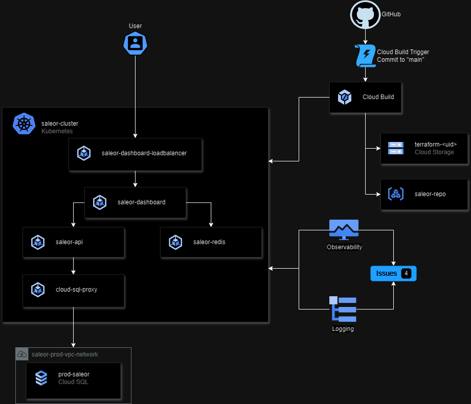

# Assumptions
- "Open-source" web application can be any license as long as it's ok to run in production (Apache,BSD,CC,MIT,etc).
- Users are primarily in Japan.
- Spanner would be a better choice for HA and scalability but most open-source tools don't support it OOB. Chose Cloud SQL
- Currently using surge upgrades for best cost to performance but it could be reworked to use blue/green instead.
- Blue/Green deploys would provide faster rollback in the case of a bug but would cost more and be more complicated from a deploy perspective.

# Design Considerations
This was tested on Windows with WSL and Git Bash.

This is setup with the assumption that the Kubernetes cluster and DB are managed by other processes.
In my experience, clusters and DBs are managed by release processes outside of the Kubernetes services release project which I believe to be the focus of this exercise.

The CD also deploys new monitoring dashboards. Depending on team organization and release structure, this may be better handled outside CD.

I've only configured a couple alerts to show how it's done but it didn't seem worth the effort considering this isn't actually going to be going to production.

The project is currently structured for one environment but it would need expanded to include parameterization if there is a QA process that has human involvement to deploy to a test system, run tests, then run deploy. Automated tests would also be a good feature to add to the release pipeline. It is currently a release straight to prod if it builds system.

Due to this being a restricted account (free), cloud builds only work in specific regions.

Since I'd like to re-purpose some of this project to be open to the public, I've chosen to go with Cloud Build rather than GitHub Actions. This keeps as much of the ecosystem for this process in GCP as possible.

# Architecture

# GCP Project Setup
These steps assume the user is a project Owner.

## Required tools
- gcloud CLI: https://cloud.google.com/sdk/docs/install
- Terraform: https://developer.hashicorp.com/terraform/tutorials/aws-get-started/install-cli
- Docker: https://docs.docker.com/desktop/ (doesn't need to be desktop but need to be able to pull/run containers)

## Steps to get the system running
1. Configure local gcloud to use the proper project and region
  - my_project=<my_project>
  - gcloud auth login
  - gcloud config set project $my_project
  - gcloud config set compute/region asia-northeast1
  - gcloud config set compute/zone asia-northeast1-a
2. Run ./project_mgmt/scripts/setup_accts_and_buckets.sh
  - Creates the bucket for terraform, enables necessary APIs, creates the terraform-creator-sa service account, sets the terraform-creator-sa's permissions
  - This service acct is used by the project_mgmt/terraform scripts to setup the DB, GKE cluster, deployer service account, deployer SA permissions, etc
3. Change the following files to reference terraform bucket from the output of the above script.
  - Update TERRAFORM_BUCKET_NAME in project_mgmt/terraform/main.tf terraform.backend.bucket
4. Run project management creation Terraform from repo root directory (takes ~20 mins)
  - terraform -chdir="./project_mgmt/terraform" init
  - terraform -chdir="./project_mgmt/terraform" apply -lock=true -var-file="props.tfvar" -var="gcp_creds=terraform-creator-key.json" -var="gcp_project=$my_project" -var="db_allowed_ip_range=<your_local_or_vpn_external_ip/32>"
5. Populate the DB with test data and user (takes 5-10 mins) (step 7 can be run while this is running)
  - project_mgmt/scripts/populate_db.sh -i prod-saleor-db-instance -d prod-saleor
6. Setup GitHub repo connection
  - From https://console.cloud.google.com/cloud-build/triggers;region=global&project=<my_project>, select "global (non-regional" for the region and click "Create trigger"
  - Name: saleor-github-repo-main-push
  - Region: global
  - Event: Push to a branch
  - Source: 1st gen
  - Repository: Connect to new repository
    - GitHub
    - Perform authentication
    - Select Repository
    - Click Connect
  - Branch: ^main$
  - Cloud Build Configuration yaml
    - Configuration File: release_pipeline/cloudbuild.yaml
  - Service Account: tf-deployer-service-acct (if not available, make sure project_mgmt/terraform ran correctly and hard refresh browser to reload available SAs)
7. Merge to main to kick off the release
  - To deploy manually, navigate to the trigger created in the previous step and click "Run"
8. Get the LB external IP for saleor-dashboard and connect to it.

# Monitoring
There are dashboards created by CD for both the database and cluster. There are also a couple example alerts configured which email when the policies are alerted. You can also view them in the GCP console.

The dashboards are found at https://console.cloud.google.com/monitoring/dashboards?project=<my_project> and are called "Saleor Prod DB Monitoring" and "saleor-cluster Dashboard". There are two alerting policies to show how they are made but more alerting would be needed for a prod system. They currently will only trigger incidents in the console. They fire on high CPU and Memory usage in the saleor-cluster. These can be used to alert when hardware capacity is low for the cluster and DB.

There is also an uptime check with an alert if the external IP of the loadbalancing K8s service doesn't respond. This is at https://console.cloud.google.com/monitoring/uptime?project=<my_project>

The Kubernetes clusters, database, builds, etc all push their logs to Cloud Logging for consumption. Logs Explorer can be used to search for errors affecting the system.

# Security Concerns
- This is using standard roles for the service accounts. Custom roles can be created to lock permissions down to only exactly the permissions needed then applying that custom role to the service accounts. For sake of time, I used standard roles.
- The Kubernetes cluster is set to disable deletion protection which is you don't want to do in a prod system. Turned deletion protection off for demo purposes.
- Web traffic is not using TLS due to not having a domain. This would need configured for a prod system.
- The tf-deployer-service-acct has permissions to manage storage objects project wide. This should be restricted to only have access to the buckets that it needs for deploying.
- It's not enabled for this but services such as Assured OSS for Cloud Build since this is a Python application and image scanning can also be enabled to ensure security concerns in underlying packages and docker images are automatically detected.
- For added security, more GKE settings could be turned on such as Workload Vulnerability Scanning.

# Destroying
This is a work in progress and has a few bugs.
1. Delete the CI/CD trigger
  - From https://console.cloud.google.com/cloud-build/triggers;region=global&project=<my_project>, click the three dots and click Delete then confirm the deletion.
2. In release_pipeline/terraform/main.tf, replace TERRAFORM_BUCKET_NAME with the proper bucket name (terraform-<gcp_project>)
3. Run destroy script from the project root directory
  - ./project_mgmt/scripts/destroy_project.sh -i prod-saleor-db-instance -d prod-saleor
